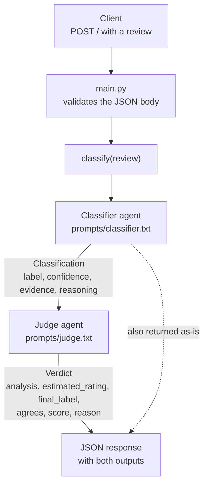

# CrewAI: Classifier + Judge

A small two-agent system that classifies movie reviews as **positive** or **negative**, has a second agent **review and, if needed, overrule** that classification, and is then **measured against the IMDB dataset**.

It is built with [CrewAI](https://docs.crewai.com/) on top of Gemini, served as a Flask API, and deployed to Google Cloud Run.

The repository has three parts:

| Part | Where | What it does |
| --- | --- | --- |
| **Classifier** | [ai_system/classifier_judge.py](ai_system/classifier_judge.py), [ai_system/prompts/classifier.txt](ai_system/prompts/classifier.txt) | Reads a review and proposes a label with evidence |
| **Judge** | [ai_system/classifier_judge.py](ai_system/classifier_judge.py), [ai_system/prompts/judge.txt](ai_system/prompts/judge.txt) | Reads the same review independently, decides the final label, and grades the classifier |
| **Evaluation** | [Prediction.ipynb](Prediction.ipynb) | Calls the deployed API on 100 IMDB reviews and compares both agents with the real labels |

## Contents

- [The idea in one minute](#the-idea-in-one-minute)
- [Repository layout](#repository-layout)
- [How a request flows](#how-a-request-flows)
- [The Classifier](#the-classifier)
- [The Judge](#the-judge)
- [How CrewAI wires the two together](#how-crewai-wires-the-two-together)
- [The API](#the-api)
- [Running it locally](#running-it-locally)
- [Deployment](#deployment)
- [Evaluation](#evaluation)
- [Things to know before you change anything](#things-to-know-before-you-change-anything)

## The idea in one minute

A single LLM call is usually right about sentiment, and it is wrong in a predictable place: **mixed reviews**. A review that spends four paragraphs complaining and then says "I'd still recommend it" looks negative if you count complaints and positive if you read the conclusion.

This project tests whether a second reader helps. The pattern is often called *LLM-as-a-judge*:

1. The **classifier** does the job.
2. The **judge** does the job again on its own, and only afterwards looks at what the classifier said.
3. If they disagree, the judge wins.

The API returns both outputs, so the evaluation can measure each agent separately and answer the real question: *did the judge add anything?*

## Repository layout

```
.
├── ai_system/                  # The deployable service
│   ├── classifier_judge.py     # Agents, tasks, output schemas, and the classify() function
│   ├── main.py                 # Flask app: one POST endpoint
│   ├── prompts/
│   │   ├── classifier.txt      # Task instructions for the classifier
│   │   └── judge.txt           # Task instructions for the judge
│   ├── requirements.txt
│   └── Dockerfile
├── .github/workflows/
│   └── deploy.yml              # Build the image and deploy to Cloud Run on every push to main
└── Prediction.ipynb            # Evaluation against IMDB
```

## How a request flows



The two agents run one after the other. Each review therefore costs two LLM calls.

## The Classifier

### The agent

An agent in CrewAI is an LLM plus a persona. The classifier's persona is defined in [classifier_judge.py:36-46](ai_system/classifier_judge.py#L36-L46):

- **Role:** sentiment classifier.
- **Goal:** classify movie reviews as positive or negative, with textual evidence.
- **Backstory:** an opinion analyst who separates the author's overall opinion from isolated remarks and detects sarcasm and mixed reviews.

`allow_delegation=False` keeps the agent from handing its work to another agent. Each agent has exactly one job here.

### The prompt

[prompts/classifier.txt](ai_system/prompts/classifier.txt) is deliberately short: classify the overall sentiment, and extract 1 to 3 **verbatim** quotes that support the decision. `{review}` is a placeholder that CrewAI fills in at run time.

Asking for quotes does two things. It forces the model to ground its answer in the text, and it gives the judge something concrete to check.

### The output

The classifier must return a `Classification` object ([classifier_judge.py:15-19](ai_system/classifier_judge.py#L15-L19)):

| Field | Type | Meaning |
| --- | --- | --- |
| `label` | `"positive"` or `"negative"` | The proposed sentiment |
| `confidence` | float, 0 to 1 | How sure the classifier is |
| `evidence` | list of strings | Quotes from the review that support the label |
| `reasoning` | string | A 1-2 sentence explanation |

This is a Pydantic model, so the output is validated. A label outside the two allowed values or a confidence of 1.4 is rejected instead of silently passing through.

## The Judge

### The agent

Defined in [classifier_judge.py:48-57](ai_system/classifier_judge.py#L48-L57):

- **Role:** independent second reader.
- **Goal:** decide the correct label from the review, and overrule the classifier whenever its own reading differs.
- **Backstory:** reaches its own verdict before looking at the classifier's, and judges by the author's final opinion, not by tone or number of complaints.

### The prompt

[prompts/judge.txt](ai_system/prompts/judge.txt) is where most of the design effort went. It has three parts.

**1. An ordered procedure.** The judge is told to work in this order:

1. Ignore the classifier. List what the author praises and criticizes.
2. Find the author's *verdict*: an explicit rating, a recommendation, the closing sentences. The verdict outweighs the count of complaints or compliments.
3. Estimate the star rating the author would give, from 1 to 10. A rating of 1-5 means negative, 6-10 means positive.
4. Only now compare with the classifier. If the labels differ, the judge's label is final.

The order matters. A judge that sees the classifier's answer first tends to agree with it, which is known as anchoring. The prompt says so directly: treat the classifier's label "as a hypothesis to test, not as a default to confirm."

The star-rating step turns a yes/no question into a scale. That makes the judge commit to *how* positive or negative the review is before it picks a side, which is useful precisely on the borderline cases.

**2. A list of known failure cases.** The prompt names the patterns the classifier gets wrong:

- The author criticizes the subject matter, historical accuracy, or faithfulness to a book, but values the film. → positive.
- The author mocks the film but enjoyed it. → follow the enjoyment.
- The author opens with concessions ("has potential", "not perfect") and concludes it is dull or not worth watching. → follow the conclusion.
- A long list of complaints followed by a recommendation, or the reverse. → follow the final judgment.

**3. A grading rubric.** The judge also scores the classifier's work from 1 to 10: do the quotes actually exist in the review, do they represent the verdict, was sarcasm handled, and is the confidence reasonable. A wrong label scores 4 or lower.

### The output

The judge returns a `Verdict` object ([classifier_judge.py:22-28](ai_system/classifier_judge.py#L22-L28)):

| Field | Type | Meaning |
| --- | --- | --- |
| `analysis` | string | What the author praises, criticizes, and concludes |
| `estimated_rating` | int, 1 to 10 | The star rating the author would give |
| `final_label` | `"positive"` or `"negative"` | **The system's final answer** |
| `agrees` | bool | Whether `final_label` matches the classifier's label |
| `score` | int, 1 to 10 | Quality of the classifier's work, per the rubric |
| `reason` | string | Why the judge confirms or corrects, in 1-2 sentences |

The field order is intentional. `analysis` and `estimated_rating` come before `final_label`, so the model writes its reasoning first and its conclusion second.

## How CrewAI wires the two together

Four CrewAI concepts are used, all in [classifier_judge.py](ai_system/classifier_judge.py):

| Concept | What it is | In this project |
| --- | --- | --- |
| `Agent` | An LLM with a role, goal and backstory | `classifier`, `judge` |
| `Task` | One piece of work assigned to an agent, with a prompt and an expected output | `classification_task`, `judge_task` |
| `Crew` | A group of agents and the tasks they run | `crew` |
| `Process` | The order the tasks run in | `Process.sequential` |

Three details do the real work:

- **`output_pydantic=...`** on each task makes the agent return a validated object instead of free text.
- **`context=[classification_task]`** on the judge's task ([classifier_judge.py:73](ai_system/classifier_judge.py#L73)) is how the judge sees the classifier's output. Without this line the judge would only have the review.
- **`crew.kickoff(inputs={"review": review})`** fills the `{review}` placeholder in both prompts and runs both tasks.

The `classify()` function ([classifier_judge.py:84-93](ai_system/classifier_judge.py#L84-L93)) wraps all of this. It runs the crew, picks the classifier's output from `result.tasks_output[0]` and the judge's from `result.pydantic` (the output of the last task), and returns both as plain dictionaries.

Both agents currently use the same model. It is set by two constants at the top of the file, `CLASSIFIER_MODEL` and `JUDGE_MODEL`, so you can give the judge a stronger model than the classifier by changing one line.

Prompts live in `.txt` files and are read by `load_prompt()`. You can edit a prompt without touching Python.

## The API

[main.py](ai_system/main.py) exposes a single endpoint.

**Request**

```bash
curl -X POST http://localhost:8080/ \
  -H "Content-Type: application/json" \
  -d '{"review": "Slow first act, but the ending made it all worth it. I would watch it again."}'
```

**Response** (`200`). The values below are illustrative; the shape is exact.

```json
{
  "classifier": {
    "label": "positive",
    "confidence": 0.85,
    "evidence": ["the ending made it all worth it", "I would watch it again"],
    "reasoning": "The author notes a slow start but ends with a clear recommendation."
  },
  "judge": {
    "analysis": "Criticizes the pacing of the first act. Praises the ending and says they would rewatch it.",
    "estimated_rating": 7,
    "final_label": "positive",
    "agrees": true,
    "score": 9,
    "reason": "The quotes are verbatim and capture the verdict rather than the complaint."
  }
}
```

**Status codes**

| Code | When |
| --- | --- |
| `200` | Both agents returned valid output |
| `400` | The body is not JSON, or `review` is missing, empty, or not a string |
| `502` | The crew failed, for example when the model returns an empty response and the structured output cannot be validated |

On an error the body is `{"error": "..."}`.

## Running it locally

You need Python 3.10 and a Gemini API key.

```bash
cd ai_system
pip install -r requirements.txt
export GEMINI_API_KEY="your-key"
gunicorn --timeout 0 --bind :8080 main:app
```

Run the commands from inside `ai_system/`. `main.py` imports `classifier_judge` as a top-level module, and the prompts are loaded relative to that file.

Or with Docker, from the repository root:

```bash
docker build -t classifier-judge ai_system/
docker run -p 8080:8080 -e GEMINI_API_KEY="your-key" classifier-judge
```

## Deployment

[.github/workflows/deploy.yml](.github/workflows/deploy.yml) runs on **every push to `main`** and does two things:

1. **Build and push.** Builds the image from [ai_system/Dockerfile](ai_system/Dockerfile) for `linux/amd64` and pushes it to Artifact Registry with two tags: the commit SHA and `latest`.
2. **Deploy.** Deploys the SHA-tagged image to Cloud Run as the service `crewia-classifier-judge` in `us-central1`, with 1 GiB of memory, a 900-second request timeout, and unauthenticated access allowed.

It needs two GitHub repository secrets:

| Secret | Used for |
| --- | --- |
| `GCP_SA_KEY` | A service account key (JSON) that can push to Artifact Registry and deploy to Cloud Run |
| `GEMINI_API_KEY` | Passed to the Cloud Run service as an environment variable |

The `concurrency` block cancels a deploy that is still running when a newer push arrives, so only the latest commit gets deployed.

The container starts gunicorn with `--timeout 0`. That disables gunicorn's own worker timeout, which would otherwise kill a request after 30 seconds. Two LLM calls in sequence can take longer than that, so the limit is left to Cloud Run.

## Evaluation

[Prediction.ipynb](Prediction.ipynb) measures the deployed service against real labels.

### What it does

1. **Loads the data.** The [IMDB dataset](https://huggingface.co/datasets/stanfordnlp/imdb) from Hugging Face, shuffled with `seed=42` so the sample is the same on every run. Labels are `0` for negative and `1` for positive.
2. **Calls the API.** For each of the first `N = 100` reviews it sends a POST request and stores four things: the classifier's label, the judge's final label, the real label, and the text.
3. **Handles failures.** `predict_sentiment()` returns `(output, error)`. A failed request is logged and skipped, so one bad review does not stop the run.
4. **Computes metrics.** Accuracy, precision, recall and F1 with scikit-learn, once for the classifier and once for the judge.
5. **Compares the two agents.** It splits the cases into three groups: the judge fixed a classifier mistake, the judge broke a correct classification, and both were wrong.

To run it you need `datasets`, `requests`, `google-auth` and `scikit-learn`. These are not in `ai_system/requirements.txt` because the service does not use them.

### Results of the saved run

One of the 100 requests failed with a `502`, because the model returned an empty response. The metrics are computed over the remaining **99 reviews**.

| | Accuracy | Precision | Recall | F1 |
| --- | --- | --- | --- | --- |
| Classifier | 0.9293 | 0.9333 | 0.9130 | 0.9231 |
| Judge | 0.9394 | 0.9348 | 0.9348 | 0.9348 |

Precision, recall and F1 treat **positive** as the target class.

| Where the two agents differ | Cases |
| --- | --- |
| Judge fixed a classifier mistake | 1 |
| Judge broke a correct classification | 0 |
| Both wrong | 6 |
| **Net effect of the judge** | **+1 correct prediction** |

The run took 852 seconds, about 8.5 seconds per review.

### How to read these numbers

- **The judge did no harm and helped once.** The classifier got 92 of 99 right and the judge got 93. One review out of 99 is too small a difference to conclude that the judge is better. A larger sample is needed to say that.
- **The two agents mostly make the same mistakes.** In 6 of the classifier's 7 errors the judge agreed with it. Both agents use the same model, so they tend to misread the same reviews. Giving the judge a different or stronger model is the most direct experiment to run next.
- **All 6 shared errors are mixed reviews**, the exact case the judge prompt is written for. Examples: a review that attacks a film's historical accuracy but is labeled positive, and a review that opens with "has the potential to be a somewhat decent movie" but is labeled negative.
- **Some IMDB labels are debatable.** A few of these reviews read as lukewarm either way, so part of the remaining error may be noise in the labels and not something a prompt can fix.

## Things to know before you change anything

- **The judge prompt was tuned on this same sample.** Phrases in [prompts/judge.txt](ai_system/prompts/judge.txt) such as "has potential", "solidly made", "not perfect" and "original idea" appear in the reviews listed under "both failed" in the notebook. Re-running the evaluation on the same 100 reviews would therefore give an optimistic result. To measure a prompt change fairly, evaluate on a different slice, for example `ds.select(range(100, 200))`.
- **The saved notebook output may not match the current prompts.** The notebook does not record which prompt version produced its results. Re-run it after any prompt change.
- **Every push to `main` redeploys production.** That includes documentation-only commits.
- **The service is public.** It is deployed with `--allow-unauthenticated`, and each request spends Gemini quota. The notebook builds an authenticated `session` but then calls the API with plain `requests.post`, so that session is not used.
- **Keep the service account key out of git.** The notebook reads `proyects-execution.json` from the working directory, and the repository has no `.gitignore`.
- **Requests are handled one at a time per container.** Gunicorn starts with its default of one synchronous worker.
- **`google-cloud-storage` is installed but not used** by the code in `ai_system/`.
- **The project ID differs between two files.** The Dockerfile sets `GOOGLE_CLOUD_PROJECT=iaportafolio`, and the workflow deploys to `iaportafolio-510415`. Nothing in the code reads the Dockerfile's value today.
